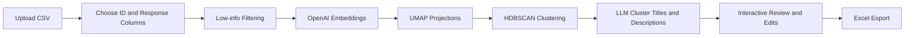
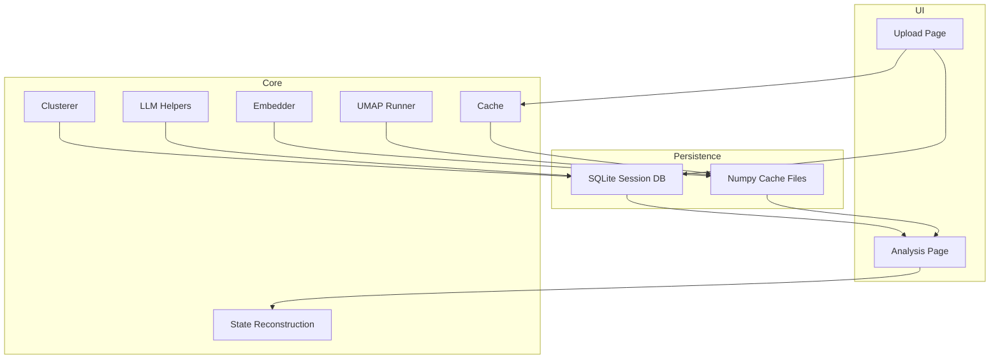
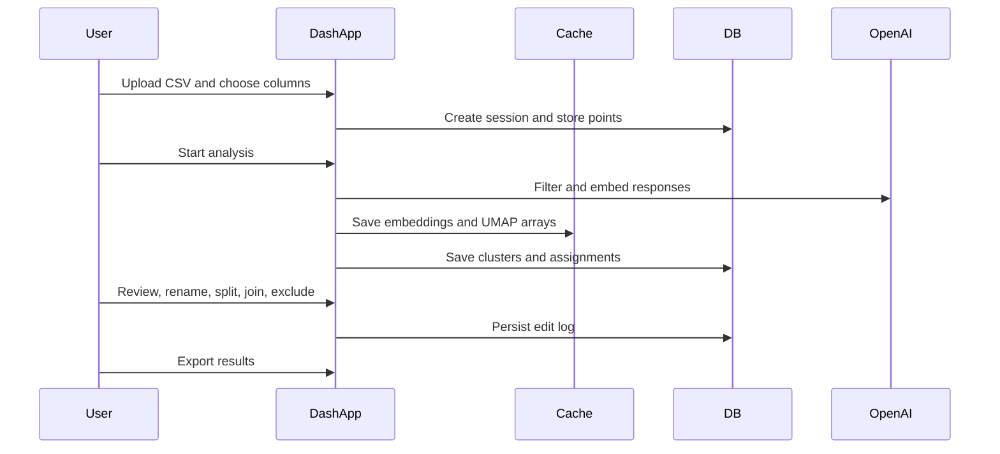

# Survey Cluster Analysis

An interactive Dash app for clustering open-ended survey responses with OpenAI embeddings, UMAP, HDBSCAN, and an editable review workflow.

The app lets you upload a CSV, choose the ID and response columns, generate embeddings, cluster responses, inspect results in a 3D plot, and refine the output before export.

## At a Glance



## App Flow



## What The Project Does

- Uploads a CSV of survey responses and lets you select the identifier and free-text columns.
- Filters low-information responses before expensive embedding and clustering steps.
- Embeds active responses with OpenAI embedding models.
- Builds both high-dimensional and 3D UMAP projections.
- Runs HDBSCAN for cluster discovery.
- Uses LLM summaries to name and describe clusters.
- Supports post-cluster editing: join, split, rename, exclude, undo, and re-cluster.
- Exports results to Excel, including optional secondary cluster assignments.

## Project Map

```text
.
├── app.py                  # Dash app entrypoint and page routing
├── config.py               # Environment variables and clustering settings
├── tasks.py                # Background task registry and progress tracking
├── callbacks/              # Upload, export, and phase control callbacks
├── core/                   # Embedding, clustering, UMAP, LLM, cache, state logic
├── db/                     # SQLite models and query helpers
├── layout/                 # Upload page, analysis page, and reusable UI components
├── cache/                  # Generated numpy artifacts for embeddings and UMAP
└── assets/                 # Static frontend assets
```

## Key Files

- `app.py`: initializes Dash, database setup, layout routing, and callback registration.
- `config.py`: loads `.env`, defines model choices, cache/database paths, and algorithm tuning.
- `callbacks/phase_controller.py`: orchestrates phase progression and background processing.
- `core/clusterer.py`: HDBSCAN clustering, representative extraction, and secondary assignment helpers.
- `core/cache.py`: persists and reloads generated arrays under `cache/`.
- `db/models.py`: SQLite schema for sessions, points, clusters, assignments, and edit history.

## Installation With uv

### 1. Install uv

If you do not already have `uv`, install it first:

```bash
curl -LsSf https://astral.sh/uv/install.sh | sh
```

On macOS with Homebrew, this also works:

```bash
brew install uv
```

### 2. Ensure Python 3.13 is available

This project declares `requires-python = ">=3.13"`.

```bash
uv python install 3.13
```

### 3. Sync dependencies

From the project root:

```bash
uv sync
```

This creates the project virtual environment and installs the dependencies from `pyproject.toml`.

### 4. Configure environment variables

Create a `.env` file in the project root:

```bash
cat > .env <<'EOF'
OPENAI_API_KEY=your_openai_api_key_here
EMBEDDING_MODEL=text-embedding-3-large
EOF
```

Notes:

- `OPENAI_API_KEY` is required unless you provide a key in the app UI.
- `EMBEDDING_MODEL` is optional. Valid values are `text-embedding-3-small` and `text-embedding-3-large`.

### 5. Run the app

```bash
uv run python app.py
```

Then open:

```text
http://127.0.0.1:8050
```

## Typical Development Workflow

```bash
uv sync
uv run python app.py
```

If you change dependencies:

```bash
uv add <package>
uv sync
```

## Runtime Artifacts

The app creates local runtime data while you work:

- `cache/`: embeddings, UMAP projections, membership matrices, centroids.
- `db/survey_clusters.db`: session metadata, points, cluster assignments, and edit history.

These files are local artifacts and should not be committed.

## User Journey



## Notes

- The UI is built with Dash and Dash Bootstrap Components.
- The app uses background tasks and interval polling so long-running phases do not block the interface.
- Export produces an Excel workbook with a response sheet and a cluster summary sheet.
